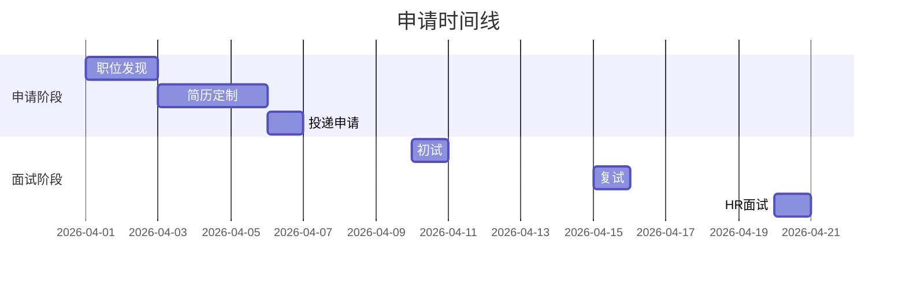

# {{title}}

## 公司基本信息
- **公司名称**：
- **行业**：
- **规模**：
- **地点**：
- **官网**：

## 职位信息
- **职位名称**：
- **部门**：
- **汇报线**：
- **薪资范围**：
- **工作地点**：

## 职位要求
- **硬技能**：
- **软技能**：
- **经验要求**：
- **教育背景**：

## 职位亮点
- 

## 匹配度分析
| 要求项 | 我的匹配情况 | 匹配度 | 提升计划 |
|--------|--------------|--------|----------|
| | | | |
| | | | |

## 面试问题预测
1. 
2. 
3. 

## 公司研究
- **企业文化**：
- **发展前景**：
- **竞争对手**：
- **近期新闻**：

## 人脉资源
- **内部联系人**：
- **推荐人**：
- **面试官**：

## 申请进度

## 关联文件
- 

---
*创建于 {{date}} {{time}}*